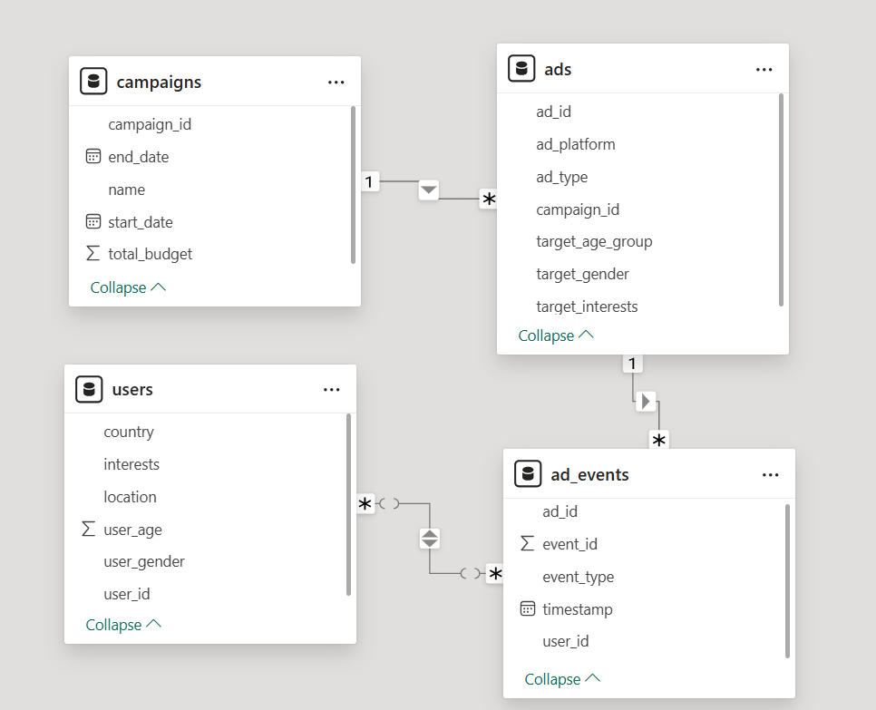
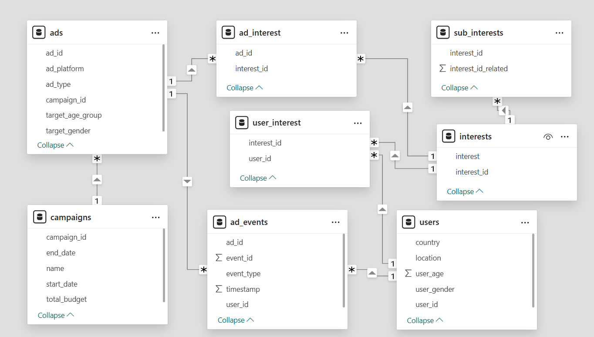
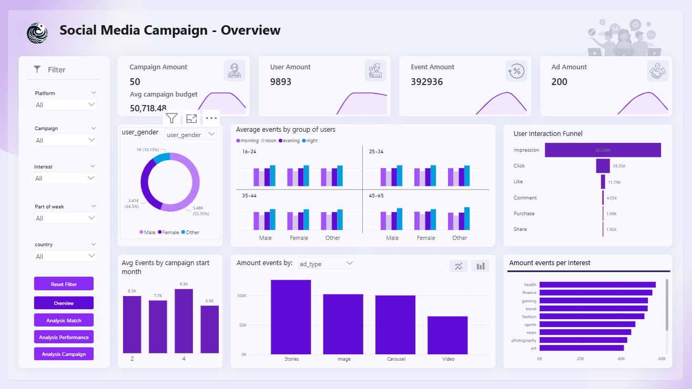
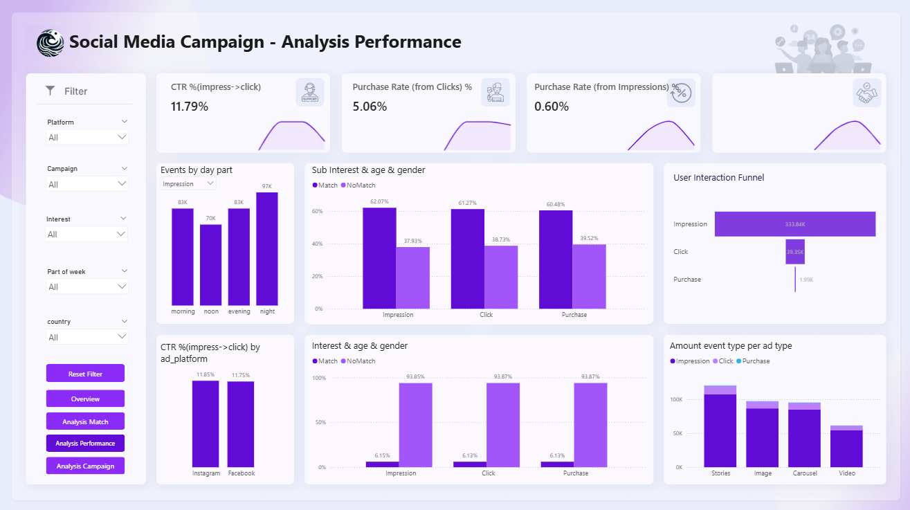
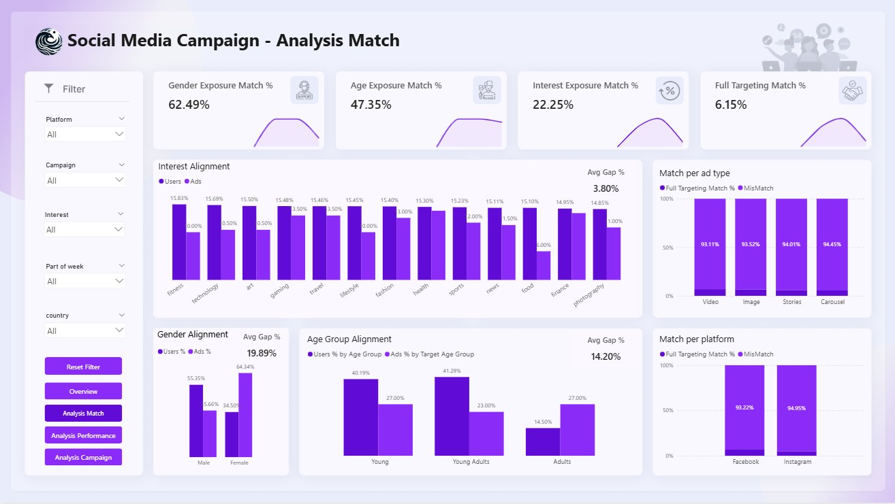
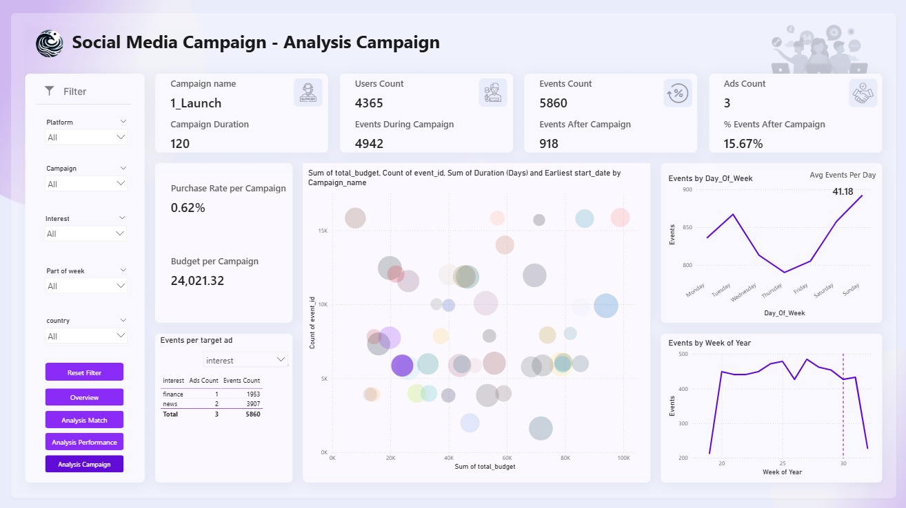

# social_media_campaign_analysis

## Table of Contents
- [Phase 1: Data Overview](#phase-1-data-overview)  
  - [Introduction](#introduction)  
  - [Data Sources](#data-sources)  
  - [Entities & Logical Relationships](#entities--logical-relationships)  
  - [Entity Relationships](#entity-relationships)  
  - [ERD (Entity Relationship Diagram)](#erd-entity-relationship-diagram)  
  - [Assumptions & Business Rules](#assumptions--business-rules)  

- [Phase 2: Data Transformation & Derived Tables](#phase-2-data-transformation--derived-tables)  
  - [Introduction](#introduction-1)  
  - [Creating the Interests Dimension](#creating-the-interests-dimension)  
  - [Generating Fact Tables](#generating-fact-tables)  
  - [Mapping Related Interests](#mapping-related-interests)  
  - [Table Relationships](#table-relationships)
  - [New ERD (Entity Relationship Diagram)](#new-erd-entity-relationship-diagram)  
  - [Final Dataset Preparation](#final-dataset-preparation)  

- [Phase 3: ETL - Extract, Transform, Load](#phase-3-etl---extract-transform-load)  
  - [Introduction](#introduction-2)  
  - [Extract](#extract)  
  - [Transform](#transform)  
  - [Load](#load)  
  - [Version Control](#version-control)  

- [Phase 4: Data Quality & Integrity Validation](#phase-4-data-quality--integrity-validation)
  - [Introduction](#introduction-3)  
  - [Validation Scope and Checks Performed](#validation-scope-and-checks-performed)

- [Phase 5: Data Cleaning & Feature Engineering](#phase-5-data-cleaning--feature-engineering)  
  - [Introduction](#introduction-4)  
  - [Data Cleaning Based on Validation Findings](#data-cleaning-based-on-validation-findings)
  - [Feature Engineering & Derived Columns](#feature-engineering--derived-columns)
  - [Final Output](#final-output)

- [Phase 6: KPI Calculations](#phase-6-kpi-calculations)  
  - [Introduction](#introduction-5)  
  - [Global Dataset Metrics](#global-dataset-metrics)
  - [Campaign-Level Analysis](#campaign-level-analysis-ad_events--ads--campaigns)
  - [Ad-Level Analysis](#ad-level-analysis-ad_events--ads)
  - [Event & Engagement Analysis](#event--engagement-analysis-ad_events--ads)
  - [User Demographics](#user-demographics)
  - [Interest-Based Engagement Analysis](#interest-based-engagement-analysis-ad_events--user_interest--interests)
  - [Interest Targeting Quality](#interest-targeting-quality-ad_events--users--ads--user_interest--ad_interest--sub_interests)
  - [Interest Demographics Analysis](#interest-demographics-analysis-user_interest--users--interests)
  - [Interest, Platform & Funnel Analysis](#interest-platform--funnel-analysis-ad_events--ads--ad_interest--interests)
  - [Temporal Engagement Analysis](#temporal-engagement-analysis-ad_events)
  - [Campaign Lifecycle Analysis](#campaign-lifecycle-analysis-ad_events--ads--campaigns)
  - [Geographic Analysis](#geographic-analysis-ad_events--users)

- [Phase 7: Visualization & Business Insights](#phase-7-visualization--business-insights)  
  - [Introduction](#introduction-6)  
  - [7.1 Dashboard Overview – Executive Summary](#71-dashboard-overview--executive-summary)  
  - [7.2 Funnel & Engagement Analysis](#72-funnel--engagement-analysis)  
  - [7.3 Targeting Match Analysis](#73-targeting-match-analysis)  
  - [7.4 Platform & Format Performance](#74-platform--format-performance)  
  - [7.5 Campaign Efficiency & Budget Allocation](#75-campaign-efficiency--budget-allocation)  
  - [Overall Business Conclusions](#overall-business-conclusions)  
  - [Strategic Recommendations](#strategic-recommendations)  

- [Project Outcome](#project-outcome)

---

## Phase 1: Data Overview

### Introduction
This project analyzes social media advertising campaigns using structured data exported from advertising platforms.  
The analysis focuses on understanding campaign structure, ad performance, and user interaction events, with the goal of enabling reliable KPI calculation, validation, and visualization.

### Data Sources
The project is based on the Excel file **social_media_campaign_analysis_source.xlsx**, which contains four sheets with the original, non-normalized data exported from social media advertising platforms:
- `users`
- `campaigns`
- `ads`
- `ad_events`

This file is preserved without modifications to ensure reproducibility and enable auditing of the analysis process.

### Entities & Logical Relationships
The data represents four core entities related to digital advertising campaigns:
- **User** – an individual interacting with ads, enabling demographic segmentation of the audience.
- **Campaign** – a marketing campaign consisting of multiple ads and a dedicated budget.
- **Ad** – a single advertisement within a campaign.
- **Ad Event** – a single interaction between a user and an ad (e.g., impression, click, conversion).

### Entity Relationships
The logical relationships between entities are hierarchical:
- **Campaign (1) → Ads (many)**  
  Each campaign can contain multiple ads, allowing aggregation of ad performance, budget allocation, and campaign-level KPIs.
- **Ad (1) → Ad Events (many)**  
  Each ad can generate multiple user interactions, such as impressions, clicks, or conversions, enabling detailed ad-level analysis.
- **User (1) → Ad Events (many)**  
  Each user can interact with multiple ads, supporting user behavior analysis, segmentation, and engagement tracking.
- **Ad Event → Ad & User**  
  Each ad event links one user to one ad, representing a single interaction. This allows combining user demographics, ad targeting, and interaction metrics for precise reporting.

### ERD (Entity Relationship Diagram)

### Assumptions & Business Rules
- Each row in `ad_events` represents a single user interaction with an ad.
- Users are identified by a unique user identifier.
- Campaign and ad identifiers are stable across the dataset. 
- Time-related fields are assumed to be in a consistent timezone.

---

## Phase 2: Data Transformation & Derived Tables

### Introduction
The raw data is transformed and structured to enable efficient analysis and reliable KPI calculation.  
Key steps include creating derived tables, mapping user and ad interests, and establishing relationships to support advanced queries and insights.

### Creating the Interests Dimension
All interests from users and ads were extracted, cleaned, and combined into a unique list.  
A dedicated **Interests Dimension Table** was created with a unique identifier for each interest, providing a consistent reference for linking users and ads.

### Generating Fact Tables
Two fact tables were created to map users and ads to interests:
- **User Interest Fact Table** – each row links a user to a single interest.
- **Ad Interest Fact Table** – each row links an ad to a single target interest.

These fact tables enable structured analysis of user preferences and ad targeting.

### Mapping Related Interests
A **Sub-Interests Table** was created to define relationships between interests (e.g., “fashion” related to “lifestyle” and “art”).  
This supports hierarchical or similarity-based analysis of interests across users and ads.

### Table Relationships
The transformation phase introduced **new relationships between the tables** to support structured analysis:

- **User Interest ↔ Interests** – each user is linked to their interests via `interest_id`. This allows querying users by any specific interest or interest cluster.  
- **Ad Interest ↔ Interests** – each ad is linked to its target interests via `interest_id`. Enables identifying which ads target specific interests or overlapping interest groups.  
- **Sub-Interests ↔ Interests** – maps each interest to its related interests. Supports hierarchical, similarity-based, or cluster analysis of interests.

These new relationships enable **complex cross-table queries**, for example:
- Counting the number of users engaged in a specific interest or related interest cluster.  
- Identifying ads that target overlapping interests across campaigns.  
- Analyzing similarity patterns between user preferences and ad targeting.

### New ERD (Entity Relationship Diagram)

### Final Dataset Preparation
Original interest columns in the `users` and `ads` tables were removed after creating the derived tables.  
All processed tables were consolidated and saved into a single Excel workbook, ready for analysis and visualization.  

---

## Phase 3: ETL - Extract, Transform, Load

### Introduction
The processed data from Phase 2 is loaded into SQL Server (SSMS) for validation and further analysis.  
The process includes data conversion, structured loading using SSIS, and preserving all tables and relationships for analysis-ready use.

### Extract
The source for ETL was the **consolidated Excel workbook created in Phase 2**, which includes all processed and derived tables:
- **Users**  
- **Campaigns**  
- **Ads**  
- **Ad Events**  
- **Interests Dimension**  
- **User Interest Fact Table**  
- **Ad Interest Fact Table**  
- **Sub-Interests Table**  

This ensures we are working with **clean, structured, and analysis-ready data**.

### Transform
- Performed **data conversion** for specific columns to match SQL Server data types.  
- Ensured consistent formatting for **dates, IDs, numeric fields, and text columns**.  
- Applied additional cleaning where needed (e.g., trimming whitespace, handling NULL values).

### Load
- Created a **new database in SSMS** to host the transformed tables.  
- Used **SSIS (SQL Server Integration Services)** to automate the data load process from Excel to SQL Server.  
- Validated that **all rows and columns were transferred correctly** and that **primary and foreign key relationships were preserved**.

### Version Control
- The **SSIS project and ETL scripts** are stored in a dedicated **Git folder** in the repository.  
- This allows **reproducibility, version tracking**, and easy access for developers to update, test, or deploy the ETL packages.

**Outcome:**  
The ETL process produced a **clean, structured, and analysis-ready database in SSMS**, ready for further **data validation, integrity checks, and KPI analysis**.

---

## Phase 4: Data Quality & Integrity Validation

### Introduction
This stage validates the quality, consistency, and reliability of the data stored in the
**SocialMedia_Campaign** database.  
The goal is to ensure that all data used for BI analysis, KPI calculations, and dashboards
is accurate and logically consistent before further analytical use.

All validations were performed directly in SQL Server (SSMS) using a dedicated SQL
validation script and cover all core tables in the data model.

### Validation Scope and Checks Performed

**1. Users Table**
- Detection of duplicate `user_id` values to identify ingestion issues or missing primary key constraints.
- Analysis of duplicate records to determine whether they represent identical user profiles or conflicting data.
- Validation of domain values in the `user_gender` column.
- Verification of realistic age ranges.
- Detection of NULL values in critical demographic attributes used for segmentation and analysis.

**2. Campaign Table**
- Validation of unique `campaign_id` values.
- Identification of duplicate campaign names that may cause ambiguity in reporting.
- Logical validation of campaign timelines (start date earlier than end date).
- Detection of missing values in essential campaign attributes such as dates and budget.

**3. Ad Table**
- Detection of duplicate `ad_id` values.
- Validation of domain consistency for `ad_platform`, `ad_type`, and `target_gender`.
- Identification of NULL values that may affect campaign–ad relationships or targeting analysis.

**4. Ads_Events Table**
- Detection of missing or duplicate `event_id` values.
- Referential integrity checks to ensure all `ad_id` and `user_id` values exist in their respective parent tables.
- Logical time validation to ensure events occur within the active date range of the associated campaign.
- Detailed inspection of events occurring before campaign start or after campaign end.

**5. Cross-Table Referential Integrity**
- Identification of ads linked to non-existing campaigns.
- Detection of campaigns that contain no associated ads, indicating incomplete configuration or unused campaigns.

**6. User_Interest Table**
- Detection of duplicate (`user_id`, `interest_id`) pairs to prevent bias in interest-based segmentation
  and analytical results.

This validation layer serves as a critical prerequisite for reliable BI modeling,
ensuring that downstream analyses, KPIs, and dashboards are based on clean,
consistent, and trustworthy data.

---

## Phase 5: Data Cleaning & Feature Engineering

### Introduction
This stage focuses on improving data reliability and analytical readiness by removing
invalid or inconsistent records identified during the validation phase, followed by
the creation of derived and grouping columns to support segmentation, aggregation,
and KPI analysis.

### Data Cleaning Based on Validation Findings
The cleaning process was driven directly by the issues detected in Phase 4 and was
implemented using Python (Pandas):

**Duplicate User Handling**
- All users with duplicate `user_id` values were fully removed to prevent ambiguity
  and biased user-level analysis.
- As a result:
  - 107 user records were removed (1.07% of the Users table).
  - All related records in dependent tables were also removed to maintain consistency.

**Cascading Cleanup Across Related Tables**
- `ad_events` records linked to removed users were deleted:
  - 4,244 records removed (1.061% of the Ad Events table).
- `user_interest` records linked to removed users were deleted:
  - 213 records removed (0.53% of the table).

**Event Time Consistency**
- Ad events occurring before campaign start dates were identified and removed.
- This eliminated interactions that could not logically belong to the campaign lifecycle.
- 2,820 event records were removed (0.705% of the Ad Events table).

After cleaning, all core tables were exported into a consolidated Excel file:
**Social_Media_Campaign_Analysis_Clean.xlsx**, preserving the relational structure
between tables.

### Feature Engineering & Derived Columns
Following the cleaning process, additional derived attributes were created to enhance
analytical capabilities and support segmentation and KPI calculation.

**Age-Based Targeting Enhancements**
- Ad target age ranges were decomposed into:
  - `min_age`
  - `max_age`
- A categorical age group label was added for ads (e.g., Young, Young Adults, Adults).

**User Demographic Grouping**
- Users were assigned to age groups using predefined bins:
  - Young
  - Young Adults
  - Adults
  - Elderly
- This enables consistent demographic aggregation across users and ads.

**Campaign Duration**
- A campaign duration column (in days) was derived from start and end dates,
  enabling duration-based performance analysis.

**Temporal Features for Ad Events**
- Multiple time-based features were extracted from event timestamps:
  - Day of week
  - Weekend indicator
  - Hour of day
  - Day part (morning, noon, evening, night)

These features enable advanced time-based analysis such as peak engagement hours,
weekday vs. weekend behavior, and performance by day-part segments.

### Final Output
The fully cleaned and feature-engineered dataset was exported into a final Excel
workbook:
**Social_Media_Campaign_Analysis_Clean&feature_engineered.xlsx**
This dataset serves as the final, analysis-ready foundation for KPI calculation,
visualization, and BI reporting.

---

## Phase 6: KPI Calculations

### Introduction
This section presents key KPI calculations and data analyses aimed at evaluating campaign performance, user engagement, and targeting effectiveness.  
The analyses are based on combined data from users, ads, campaigns, and interaction events, and provide insights across campaigns, platforms, demographics, interests, and time-based patterns to support data-driven decision making.

### Global Dataset Metrics
These checks provide a high-level overview of the dataset size and scope:
- **Total Interactions** – counts the total number of ad events, representing overall user activity.
- **Total Users** – counts unique users participating in ad interactions.
- **Total Ads** – measures the total number of ads analyzed.
- **Total Campaigns** – represents the number of active marketing campaigns included in the analysis.
These metrics establish baseline context for all KPI calculations.

### Campaign-Level Analysis 
**(ad_events + ads + campaigns)**

- **Interactions by Campaign**  
  Measures the total number of interactions generated by each campaign, enabling comparison of campaign engagement levels.

- **Campaign Performance vs. Budget**  
  Aggregates interactions per campaign alongside total campaign budget to support evaluation of engagement relative to investment size.

### Ad-Level Analysis 
**(ad_events + ads)**

- **Interactions by Ad**  
  Calculates interaction volume per individual ad to identify high- and low-performing creatives.

- **Interactions by Ad Platform**  
  Aggregates interactions by advertising platform to assess where user engagement is strongest.

- **Interactions by Ad Type and Platform**  
  Breaks down interaction volume by both platform and ad format, enabling format-level performance comparison within platforms.

### Event & Engagement Analysis 
**(ad_events + ads)**

- **Interactions by Event Type and Platform**  
  Analyzes how different types of user actions (e.g., impressions, clicks, purchases) are distributed across platforms, supporting funnel and engagement analysis.

### User Demographics 
**Age Analysis (ad_events + users)**
- **Interactions by User Age Group**  
  Measures engagement volume per age segment to identify which age groups are most active.

- **Ad Target Age vs. User Age Matching**  
  Compares ad target age groups with actual interacting users and calculates interaction ratios, evaluating age-based targeting accuracy.

**Gender Analysis (ad_events + users + ads)**
- **Interactions by Gender**  
  Aggregates interaction volume by user gender to identify engagement differences.

- **Ad Target Gender vs. User Gender Matching**  
  Compares ad target gender with actual interacting users and calculates interaction ratios to assess gender targeting effectiveness.

### Interest-Based Engagement Analysis 
**(ad_events + user_interest + interests)**

- **Interactions by Interest**  
  Measures total engagement per interest category, identifying the most engaging topics.

### Interest Targeting Quality 
**(ad_events + users + ads + user_interest + ad_interest + sub_interests)**

- **Interest Match Classification**  
  Classifies user–ad interactions into exact matches, related (family) matches, or no matches, enabling evaluation of interest targeting precision.

- **Interest Match Summary per Ad**  
  Aggregates match types per ad to assess how well each ad aligns with user interests.

### Interest Demographics Analysis 
**(user_interest + users + interests)**

- **Interest Distribution by Age Group**  
  Counts unique users per interest and age group, supporting demographic preference analysis.

- **Interest Distribution by Gender**  
  Counts unique users per interest and gender to identify gender-based interest patterns.  
  This helps identify which topics resonate more with male or female audiences and informs targeted campaign strategies.

### Interest, Platform & Funnel Analysis 
**(ad_events + ads + ad_interest + interests)**

- **Interest Performance Across Platforms and Event Types**  
  Analyzes how each interest performs across platforms (e.g., Facebook, Instagram, TikTok) and across different types of events (impressions, clicks, conversions).  
  This enables multi-dimensional funnel insights and supports cross-platform optimization.

### Temporal Engagement Analysis 
**(ad_events)**

- **Interactions by Day of Week**  
  Identifies trends in user engagement across different weekdays.  

- **Interactions by Hour of Day**  
  Highlights peak engagement hours for more precise ad scheduling.  

- **Interactions by Day Part**  
  Aggregates interactions into morning, noon, evening, and night segments to simplify analysis of user activity patterns.  

- **Weekday vs. Weekend Engagement**  
  Compares interaction volumes and average engagement metrics between weekdays and weekends, providing insights into audience behavior patterns.

### Campaign Lifecycle Analysis 
**(ad_events + ads + campaigns)**

- **Events During vs. After Campaign**  
  Compares interactions that occurred during the active campaign period versus post-campaign interactions.  
  This helps evaluate lifecycle impact and residual exposure effects.

### Geographic Analysis 
**(ad_events + users)**

- **Interactions by Country**  
  Aggregates engagement data by user country to identify geographic distribution and regional performance patterns.  
  This is useful for optimizing targeting and resource allocation by region.

---

## Phase 7: Visualization & Business Insights

### Introduction
This phase focuses on converting the validated data model and KPI analyses into an **interactive, visually intuitive BI dashboard** in Power BI.  

The goal is to **transform raw and cleaned data into actionable business insights**. Rather than just showing numbers, the dashboard is designed to highlight patterns, bottlenecks, and opportunities in campaign performance, ad targeting, and audience engagement.  

The visualization layer addresses key business questions:  
- Are campaigns reaching the intended audience?  
- Which campaigns, ads, platforms, and ad formats are most effective?  
- How is user engagement distributed across demographics, interests, time, and geography?  
- Where should budgets and creative resources be focused for maximum efficiency?  

This phase is critical for translating the results of the data analysis into **practical recommendations** for marketing strategy.

---

### 7.1 Dashboard Overview – Executive Summary
The **Executive Summary** provides a high-level snapshot of overall campaign performance, suitable for managers and decision-makers.  

**Key Metrics Displayed:**  
- Total Users – how many unique users interacted with ads.  
- Total Events – total interactions across all campaigns.  
- Events During vs. After Campaign – engagement that happened while the campaign was active versus post-campaign residual activity.  
- % Post-Campaign Events – shows residual exposure impact.  
- Purchase Rate – overall conversion from engagement to purchase.  
- Budget per Campaign – shows spending across campaigns.  
- Ads Count – number of ads per campaign, useful for comparing scale versus engagement.

**Insights:**  
- High-level overview quickly shows which campaigns are scaling well and which require optimization.  
- Some campaigns with moderate budgets outperform larger campaigns, indicating high efficiency.  
- Residual post-campaign activity highlights the lasting impact of campaigns even after official end dates.  
- Executive users can use this summary to **spot trends, anomalies, and areas for immediate action**.  

**Screenshot**  

---

### 7.2 Funnel & Engagement Analysis
This section visualizes the **user engagement journey** through the marketing funnel:  
**Impression → Click → Engagement → Purchase**

**Key Insights:**  
- Click-through rates are above industry benchmarks, showing strong ad visibility and engagement.  
- The **largest drop-off occurs between Click and Purchase**, highlighting a post-click conversion challenge.  
- High engagement at earlier funnel stages suggests that ad content is compelling, but landing pages or follow-up steps may need optimization.  

**Business Implication:**  
- Optimization should focus on post-click conversion improvements (landing pages, forms, checkout processes).  
- Ad creative alone is not the bottleneck; the funnel after the click determines the actual ROI.

**Screenshot**  

---

### 7.3 Targeting Match Analysis
This dashboard evaluates **how well campaigns reach their intended audience** based on demographic and interest alignment.

**Dimensions Evaluated:**  
- Gender Targeting vs. Actual Gender Distribution  
- Age Targeting vs. Actual Age Groups  
- Interest Match Classification: Exact Match / Related Interest Match / No Match  

**Insights:**  
- Gender targeting generally aligns but shows some exposure bias.  
- Age targeting shows mismatches in multiple campaigns, indicating a need to refine segmentation.  
- Exact interest matches are moderate; including related interests significantly increases alignment.  

**Business Implication:**  
- Targeting precision is one of the largest levers for improving campaign ROI.  
- Aligning creative, ad placement, and targeting with actual user behavior can increase engagement and conversions significantly.

**Screenshot**  

---

### 7.4 Platform & Format Performance
This section evaluates **ad performance by platform (e.g., Facebook, Instagram, TikTok) and ad format (e.g., Stories, Feed, Video, Carousel)**.  

**Key Insights:**  
- Platform performance differences exist but are moderate overall.  
- Ad format has a stronger effect on engagement and conversion metrics than platform choice.  
- Story-format ads perform particularly well across multiple interest segments, but the optimal format varies depending on the audience and interest category.  

**Business Implication:**  
- Creative strategy should be tailored to **specific audience segments**, rather than applying a uniform approach across platforms.  
- Understanding which formats resonate with which interests allows for better creative planning and budget allocation.

**Screenshot**  

---

### 7.5 Campaign Efficiency & Budget Allocation
This dashboard evaluates **campaign-level efficiency** relative to budget, duration, engagement, and conversion.

**Insights:**  
- Campaigns can be classified into:  
  - **High Efficiency** – candidates for scaling.  
  - **Medium Efficiency** – require optimization.  
  - **Low Efficiency** – consider reducing budget or pausing.  
- Long-duration campaigns show declining marginal efficiency, suggesting audience fatigue over time.  
- Comparing engagement versus budget highlights campaigns with **high ROI potential**.

**Business Implication:**  
- Budget allocation should prioritize **efficiency over absolute spend**, focusing on campaigns that generate higher engagement per unit of budget.  
- Campaigns with signs of audience fatigue should either refresh creative content or reduce duration to maintain impact.

**Screenshot**  

---

### Overall Business Conclusions
The visualizations and KPI analyses lead to several strategic conclusions:  
1. Targeting precision is the **primary area for improvement**.  
2. Higher budgets do not automatically lead to higher performance; efficiency matters more than scale.  
3. Creative format selection has a **greater impact on performance than platform choice**.  
4. Conversion bottlenecks are primarily **post-click**, requiring landing page and funnel optimization.  

These insights allow stakeholders to make informed, **data-driven marketing decisions**.

---

### Strategic Recommendations
- Refine audience segmentation using **behavioral and related-interest data**.  
- Integrate **interest-family logic** to improve targeting effectiveness.  
- Conduct **A/B testing on landing pages** to improve post-click conversion.  
- Adjust campaign durations to reduce audience fatigue and improve ROI.  
- Allocate budgets based on **efficiency metrics**, not just total spend.  
- Customize ad formats for specific audience segments to maximize engagement.

---

### Project Outcome
This project demonstrates the full progression:  

**Structured Data → Validated Data Model → KPI Analysis → BI Dashboard → Strategic Insights**  

The Power BI dashboard transforms raw advertising data into **actionable insights**, enabling marketers to optimize campaigns, improve targeting accuracy, allocate budgets more efficiently, and ultimately achieve measurable performance improvements.